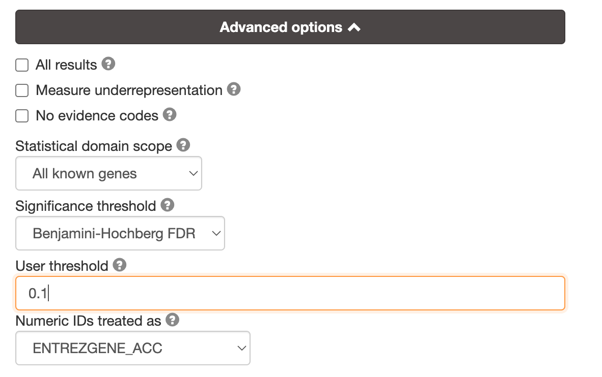

# [gProfiler](https://biit.cs.ut.ee/gprofiler_beta/gost)

## Pasted LOCs into gProfiler "g:GOSt Functional profiling" tab. 

unique_greyloc.csv
```
LOC111122443
LOC111118819
LOC111118818
LOC111122539
LOC111127813
LOC111133892
LOC111132244
LOC111136055
LOC111134484
LOC111136737
LOC111138502
LOC111132776
LOC111136376
LOC111135284
LOC111138058
LOC111102377
LOC111102455
LOC111104540
LOC111104539
LOC111104349
LOC111103305
LOC111103307
LOC111104148
LOC111104147
LOC111104284
LOC111114989
LOC111111318
LOC111112301
LOC111112302
LOC111114592
LOC111114145
```

## Settings for gProfiler Functional profiling
**Selected *Crassostrea virginica* from the Organism dropdown menu and usesd the following settings**




## [Link to query for module grey](https://biit.cs.ut.ee/gplink/l/iUolaMPHQP)
- phosphoglycerate dehydrogenase activity 
- ion binding 
- ATP-protein folding chaperone
- calcium ion binding
- metal ion binding 
- cation and anion binding
- serine family amino acid metabolic process 
- histone methylation
- protein alkylation (GO:0008213): The addition of an alkyl group to a protein amino acid. Alkyl groups are derived from alkanes by removal of one hydrogen atom.


## [Module blue gProfiler query](https://biit.cs.ut.ee/gplink/l/yBlhYIssSJ)
- run on the first 100 genes `unique_blueloc.csv`
- DNA binding transcription factor activity, RNA polymerase II specific (GO:0000981)
- DNA binding transcription factor activity (GO:0003700)
- transcription regulator activity (GO:0140110)
- DNA binding 
- nucleic acid binding
- regulation of 
    - RNA metabolic processes
    - cellular biosynthetic processes
    - nucelobase containing compounds
    - macromolecule biosynthesis process
    - biosynthetic process
    - DNA-templated transcription
    - ...

