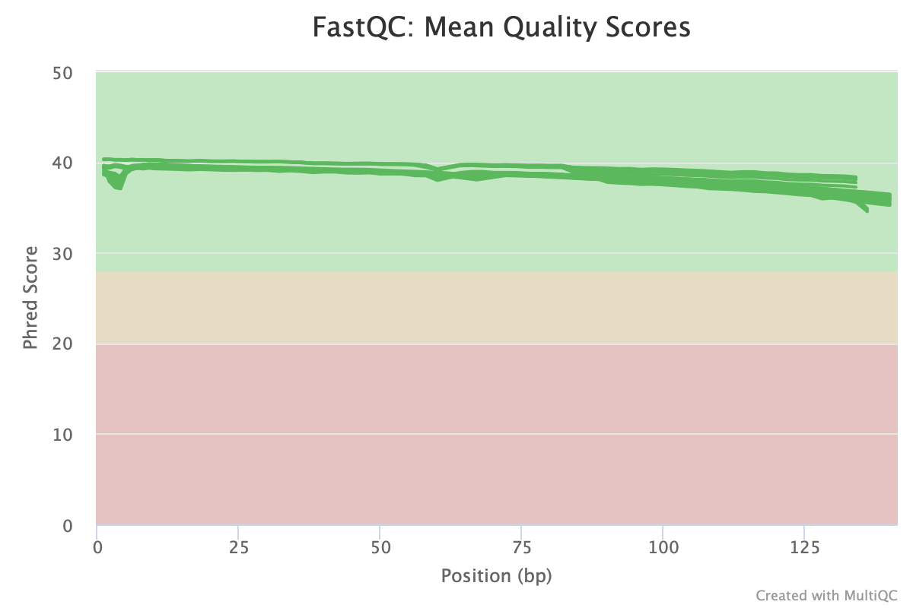
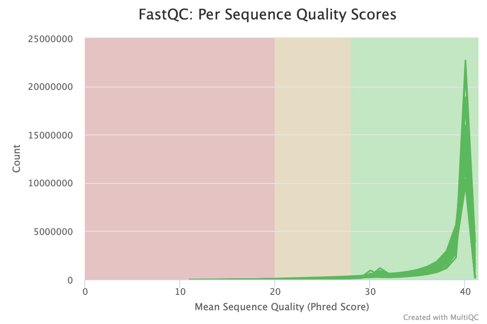
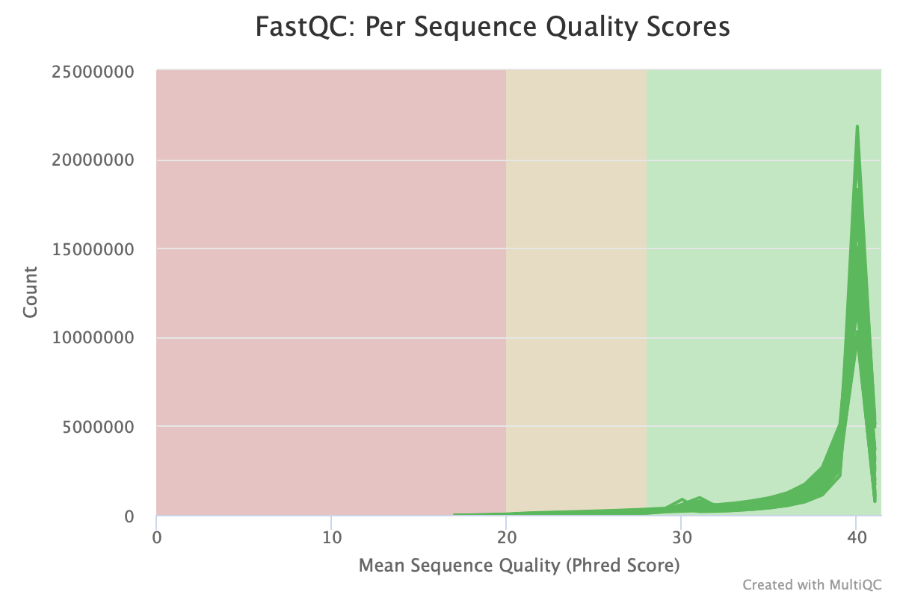

# CASE RNASeq Analysis : QC, Read Trimming, Read Alignment, and Transcript Assembly

**Author: Megan Guidry**

Original analysis and markdown authored by [Maggie Schedl](https://github.com/meschedl). Maggie's analysis workflow is annotated in the `CASE-RNA-Analysis.md` file also in [this directory](https://github.com/mguid73/Larval-Oyster-CASE-RNA). 

**This document is an adapation of Maggie's analyses and markdown notes but with an _improved reference genome_ for the eastern oyster.**

This markdown references Erin Robert's [RNASeq pipeline](https://github.com/erinroberts/apoptosis_data_pipeline/blob/master/Streamlined%20Pipeline%20Tutorial/Apoptosis_Pipeline_Tutorial_with_Reduced_Dataset.md) or Kevin Wong's [project](https://github.com/jpuritz/BIO_594_2018/blob/master/FinalAssignment/KevinWong_FinalAssignment/P.dam_DE_Analysis.md) in [J. Puritz's](https://github.com/jpuritz) Bio594 2018.  If other resources were used they should be linked in this markdown. If anything is not linked properly, not-sourced, or looks missing please contact at mguidry@uri.edu.

All analysis was done on our lab shared server, KITT, made by [J. Puritz](https://github.com/jpuritz) in /home/mguidry/Working_CASE_RNA 

Programs Installed/Needed for this Project:  
- HISAT2 
- StringTie 
- gffcompare 
- fastp, fastQC, multiqc
- samtools

File Naming and Information:

location of reference genome on KITT: `/RAID_STORAGE2/Shared_Data/Oyster_Genome/masked/masked.cvir.genome.fasta`

- `masked.cvir.genome.fasta`: Eastern Oyster genome
- `ref_C_virginica-3.0_top_level.gff3`: annotation file for the Eastern Oyster, I also got this from Erin, it has the matching header line convention to work with the above genome
- `prepDE.py`: python script for converting read count information from StringTie into a matrix fo DESeq2, full code [here](http://ccb.jhu.edu/software/stringtie/dl/prepDE.py)
- `CA_J06`: this is an example of the naming convention of the samples, CA refers to the treatment (coastal acidification), and the J number refers to the replicate jar

-------

## Before you begin...
Create conda environment & install packages
```
conda create -n CASE-RNA hisat2 stringtie gffcompare fastp fastQC multiqc samtools
conda activate CASE-RNA
```

`conda list` will allow you to look at all of the packages you have installed in your environment.

## Quality Control and Read Trimming
Steps:

1. Set up and first look
2. Raw read QC
3. Trimming with fastp
4. Trimmed read QC
5. Aligning


## 1. Set up
Reads were already de-multiplexed and assigned to each individual sample by [J. Puritz](https://github.com/jpuritz), and linked to a directory called CASE_RNA.

 I made a "working" directory and linked in the files to that directory.
```
mkdir Working-CASE-RNA
cd Working-CASE-RNA
ln -s /home/mguidry/CASE_RNA/* .
ls
```
Output:
```
CA_J06.F.fq.gz  CA_J08.F.fq.gz  CA_J11.F.fq.gz  CA_J18.F.fq.gz  CASE_J03.F.fq.gz  CASE_J09.F.fq.gz  CASE_J12.F.fq.gz  CASE_J13.F.fq.gz  CON_J02.F.fq.gz  CON_J05.F.fq.gz  CON_J10.F.fq.gz  SE_J01.F.fq.gz  SE_J04.F.fq.gz  SE_J07.F.fq.gz
CA_J06.R.fq.gz  CA_J08.R.fq.gz  CA_J11.R.fq.gz  CA_J18.R.fq.gz  CASE_J03.R.fq.gz  CASE_J09.R.fq.gz  CASE_J12.R.fq.gz  CASE_J13.R.fq.gz  CON_J02.R.fq.gz  CON_J05.R.fq.gz  CON_J10.R.fq.gz  SE_J01.R.fq.gz  SE_J04.R.fq.gz  SE_J07.R.fq.gz 
```

### Check out read counts
**Purpose:** We want to get an idea of the read counts across our sample files.

Look at the read counts for each file using a code from [this website](http://www.sixthresearcher.com/list-of-helpful-linux-commands-to-process-fastq-files-from-ngs-experiments/) made into a for-loop that went through all the files. It outputs the filename and the number of reads in that file.


```
for fq in *.fq.gz
> do
>	echo $fq
> zcat $fq | echo $((`wc -l`/4))
> done
```

Output:

Takes roughly ~1-2min per sample
```
CA_J06.F.fq.gz
20445176
CA_J06.R.fq.gz
20445176
CA_J08.F.fq.gz
21746189
CA_J08.R.fq.gz
21746189
CA_J11.F.fq.gz
25550864
CA_J11.R.fq.gz
25550864
CA_J18.F.fq.gz
37263541
CA_J18.R.fq.gz
37263541
CASE_J03.F.fq.gz
26925142
CASE_J03.R.fq.gz
26925142
CASE_J09.F.fq.gz
31720810
CASE_J09.R.fq.gz
31720810
CASE_J12.F.fq.gz
24582739
CASE_J12.R.fq.gz
24582739
CASE_J13.F.fq.gz
36132924
CASE_J13.R.fq.gz
36132924
CON_J02.F.fq.gz
28850301
CON_J02.R.fq.gz
28850301
CON_J05.F.fq.gz
27446573
CON_J05.R.fq.gz
27446573
CON_J10.F.fq.gz
35291136
CON_J10.R.fq.gz
35291136
SE_J01.F.fq.gz
28376966
SE_J01.R.fq.gz
28376966
SE_J04.F.fq.gz
24827716
SE_J04.R.fq.gz
24827716
SE_J07.F.fq.gz
30894132
SE_J07.R.fq.gz
30894132
```

## 2. Raw read quality check
**Purpose:** Establish a baseline of what the read quality looks like to help determine trimming parameters in the next step. 

Checked out the quality of the reads in each `.fq.gz` file using [MultiQC](https://multiqc.info/) & [FastQC](https://www.bioinformatics.babraham.ac.uk/projects/fastqc/). We'll go back and run the same on the trimmed data in the next couple of steps too. But first, we want to get an idea of what the data look like before trimming.

```
mkdir fastqc-raw
cd fastqc-raw/
fastqc ../*fq.gz   #took about 1.5-2 hrs for these data
mv *fastqc.* fastqc-raw/
cd fastq-raw/
ls  #the *fastqc* files should all be in the fastq-raw directory now
multiqc .
```

Now I have a `multiqc_report.html` file which I transfered on to my local computer to look at in a web browser. 
_____________________
There are a couple ways I could have 'transfered' that file over to local. I downloaded it from Visual Studio code's Explorer pane. I could have used the following line to file transfer from KITT to my local computer. This code would be run from my local terminal (not on KITT). Alternatively, I could have used a file transfer software like Cyberduck.
```
ls
scp -P zzzz mguidry@KITT.uri.edu:/home/mguidry/Working-CASE-RNA/fastqc-raw/multiqc_report.html ~/Desktop
```
______________________
Once you have `multiqc_report.html` locally, simply run `open multiqc_report.html` in terminal from the directory that the file is in. This will open the report in your browser and from there you can poke around on it looking through the different module reports.

### Digging into the raw reads
Here, I will focus on the quality scores of the raw reads. 


***Mean Phred score at each base in the sequence.*** 

**These quality scores look good! Phred score>30 is an indicator of good quality!** 

Follows the expected trend of a slight decrease in quality at the end of the read. There is a slight dip at the beginning of some of the reads - not sure why? Overall though, this is good quality data.


***Count of Sequences across quality scores.*** 

**This plot also indicates good quality with a large peak in the number of sequences with a Phred score around 40 and most above 30!** 

However there is still a tail of sequences with lower scores that can be trimmed.
_______________
**There are lots of other visualizations in the multiQC report that have informative data, but for now, I will move on to trimming our raw reads.**
___________

## 3. Trimming raw reads with [`fastp`](https://github.com/OpenGene/fastp)
**Purpose:** Cleaning up the raw reads to improve quality of sequences used in future analyses. 

`fastp` flags:

`-i` = input file, forward

`-I` = input file, reverse

`-o` = output file, forward

`-O` = output file, reverse

`-f` or `-t` = front or tail trimming setting, forward

`-F` or `-T` = front or tail trimming setting, reverse (if not specified, reverse settings will be default set to whatever the forward parameters are)

`-u` = how many percent of bases are allowed to be unqualified (integer value 0-100); default is 40%


In my `Working-CASE_RNA` directory, I used `fastp` with the following code. 
```
mkdir trimmed  #directory for trimmed read files
```

This takes roughly ~2-25 mins per sample. I ran this for each set of paired end reads. I know there is a more elegant way to loop through these though. 
```
fastp -i CA_J06.F.fq.gz -I CA_J06.R.fq.gz -o trimmed/CA_J06.F.trim.fq.gz -O trimmed/CA_J06.R.trim.fq.gz  -f 5 -F 5 -q 15 -u 50 -j trimmed/CA_J06.json -h trimmed/CA_J06.html
```

Check how many files are in the trimmed directory. It should be 56 files total (1 F, 1 R, 1 .html, 1 .json *for each sample*). There are 14 samples.
```
cd trimmed
ls | wc -l  #check total number of files (56)
ls *.json | wc -l   #output: 14
ls *.html | wc -l   #output: 14
ls *.R.trim.fq.gz | wc -l  #output: 14
ls *.F.trim.fq.gz | wc -l  #output: 14
```
Sweet! Now all of the reads have been trimmed with `fastp`. We'll check out the quality scores of the trimmed sequences in the next step. 

## 4. Trimmed read quality check
**Purpose:** Ensure that the trimming did what we wanted it to do (i.e. cleaned up lower quality tails). 

Running QC like I did for the raw reads. Directing fastqc files and reports to a `fastqc-trimmed` directory. 

```
mkdir fastqc-trimmed
fastqc /trimmed/*fq.gz   #took 2.5-3hrs
cd trimmed
mv *fastqc.* ../fastqc-trimmed/
cd ../fastqc-trimmed/
ls  #the *fastqc* files should all be in the fastqc-trimmed directory now
multiqc .
```

### Checking out the trimmed reads
Looking at some plots from the MultiQC report we just generated.

Again there is a lot to look at in these reports but here I've just included a few sequence quality plots. 


***Trimmed data. Mean Phred score at each base in the sequence.*** No more dip in quality around bp 135.



***Trimmed data. Count of Sequences across quality scores.*** 

These plots look a little more smoothed out than the pre-QC data!
Next I moved on to mapping those new, trimmed fasta files to the Eastern Oyster Genome.

## 5. Alignment to the *Crassostrea virginica* genome with [HISAT2](http://daehwankimlab.github.io/hisat2/manual/)
In May 2022, I used an updated version of the *C. virginica* genome available at /RAID_STORAGE2/Shared_Data/Oyster_Genome/masked/masked.cvir.genome.fasta on KITT. 

**November 2022**, I am using the *C. virginica* reference genome available on KITT at `/home/Genomic_Resources/C_virginica/reference.fasta`


To align the trimmed reads to the genome, I used [HISAT2](http://daehwankimlab.github.io/hisat2/manual/). I chose this aligner based on recommendations made by [Bahrami 2020](https://www.clinmedjournals.org/articles/jggr/journal-of-genetics-and-genome-research-jggr-7-048.pdf):

>HISAT2 resulted in the highest percentage of correctly mapped reads when compared to TopHat2, STAR, and Bowtie2 (other alignment softwares).


**Set up.** For ease of naviagation, I created a new directory for aligning reads called `alignment2ref`. In this directory, I linked to the trimmed `fq.gz` reads and linked to the genome.
```
cd /home/mguidry/Working-CASE-RNA/
mkdir alignment2ref
cd alignment2ref

ln -s /home/mguidry/Working-CASE-RNA/trimmed/*.trim.fq.gz .
ln -s /home/Genomic_Resources/C_virginica/reference.fasta 
```

**Running HISAT2.** I ran the following script, called `CASE-HISAT2.sh` (originally authored by Maggie Schedl, updated version 7/2020 to account for strandedness). At this point, I double-checked that I was in the conda environment `CASE-RNA` I had made earlier because this is where I have HISAT2 installed.

This script first makes an index using the reference genome then it aligns each trimmed `fq.gz` file to the genome using that index. You only need to make the index once. Next, hisat2 takes in the paired sequences and aligns them to the index and produces 1 SAM file. Next steps convert SAM to BAM then sort BAM. Finally the SAM file is deleted and the alignment info is stored in a folder called 'summaries'.

Running each sample pair (fwd/rev) took about 25mins. (Began running ~11:50am 12/6/22 and finished ~2:50am 12/7/22)

```
nano /home/mguidry/Working-CASE-RNA/alignment2ref/CASE-HISAT2.sh
```
```
##!/bin/bash

#Specify working directory
F=/home/mguidry/Working-CASE-RNA/alignment2ref

#Indexing a reference genome and no annotation file (allowing for novel transcript discovery)
#Build HISAT index with Cvirginica genome file - once the index is built, you don't have to re-run this
hisat2-build -f $F/reference.fasta $F/cvirginica_hisat
#-f indicates that the reference input files are FASTA files

#Aligning paired end reads
#Has the F in here because the sed in the for loop changes it to a R. 
#SAM files are of both forward and reverse reads (one SAM file for each pair of Fwd and Rev)
array1=($(ls $F/*F.trim.fq.gz))


#for each file in the array...
#aligns the given files (Fwd & Rev) to the index (previously generated) with the --dta flag indicating to report the alignments tailored for transcript assemblers 
#then outputs the alignment summary to a sample specific summary file
#next samtools view converts the sam to bam and samtools sort converts the bam to a sorted (smaller) bam file that stringtie will like
#finally we remove the sam file because it's really big and we dont need it anymore
for i in ${array1[@]}; do 
        hisat2 --dta -x $F/cvirginica_hisat -1 ${i} -2 $(echo ${i}|sed s/F.trim/R.trim/) --rna-strandness FR -S ${i}.sam 2>${i}.alignsummary.txt
        samtools view -bS ${i}.sam > ${i}.bam
        samtools sort ${i}.bam -o ${i}.s.bam
    		echo "${i}_bam"
        rm ${i}.sam
        echo "HISAT2 PE ${i}" $(date)
done

#move all of the summary files to their own directory
mv *.alignsummary.txt ./summaries
```
Sorted BAM files are then used with StringTie to generate annotation files with transcript abundances.  
**Range of ~79-84% alignment rate across samples.** Alignment summaries stored in /alignment2ref/summaries.

## 6. Transcript Assembly with [StringTie](https://ccb.jhu.edu/software/stringtie/index.shtml?t=manual)

Created a new directory for running the transcript assembly called 'stringtie'. In that directory, I've linked in the annotation file (that lives in storage) and the sorted BAM files we made in the step above.

```
mkdir stringtie
cd stringtie
ln -s /RAID_STORAGE2/mschedl/RNA-CASE/ref_C_virginica-3.0_top_level.gff3 .
ln -s /home/mschedl/Working-CASE-RNA/histat/*.s.bam .
```

>Note from Maggie's workflow: 
"Originally, I had tried to run StringTie with the annotation file downloaded from [NCBI](https://www.ncbi.nlm.nih.gov/genome/?term=Crassostrea%20virginica), which did not work, but that may have been for a variety of reasons at the time."


# Notes to self