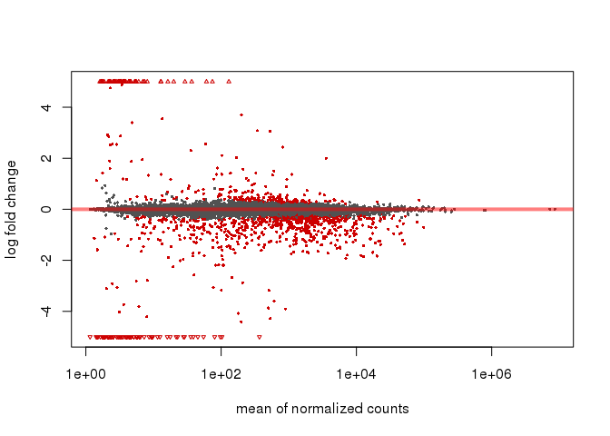
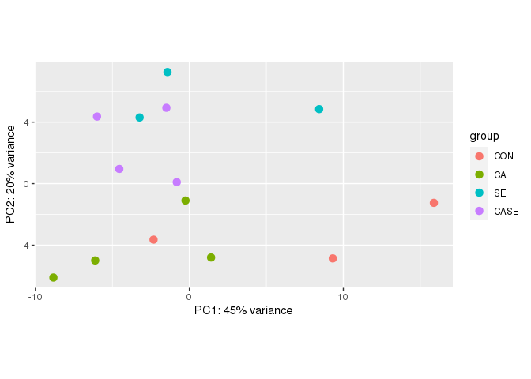
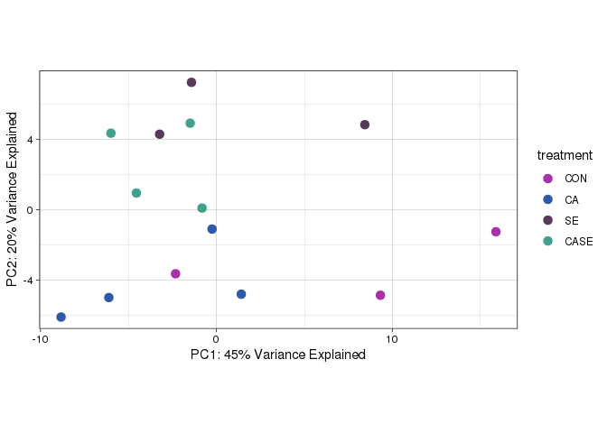
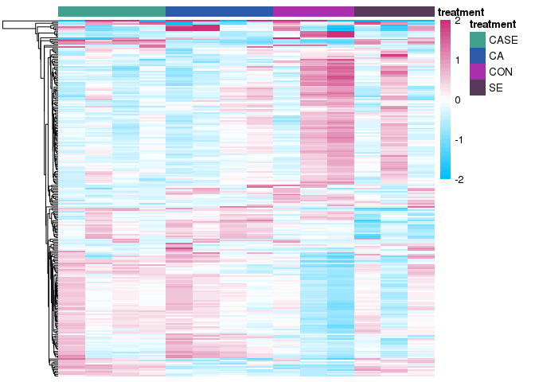
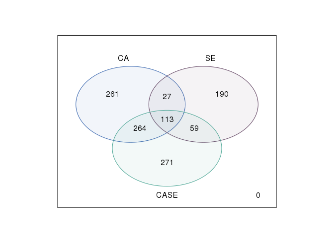
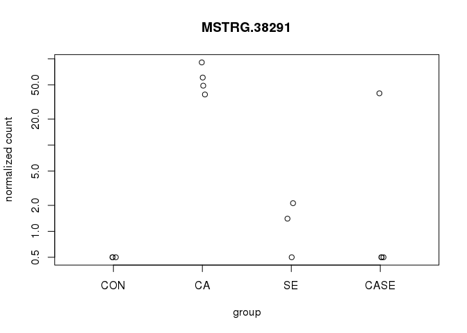
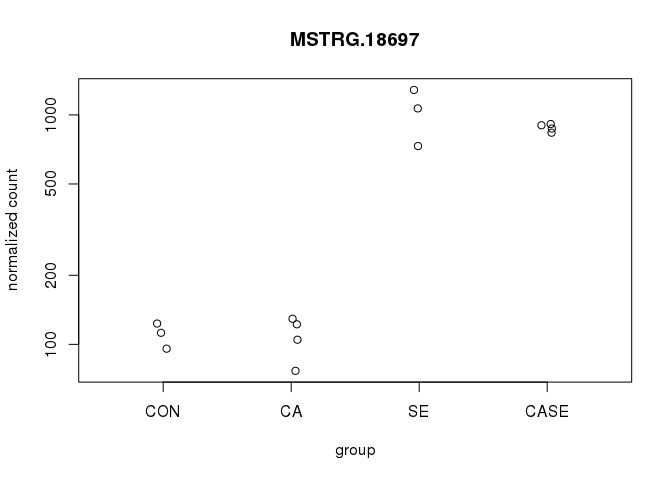

CASE-DESeq2-2
================
Megan Guidry
2/22/2020

Following Maggie’s original scripts ‘DESeq_CASE_RNA.md’ (June 2019) and
‘2nd-DESeq2.md’ (April 2020) with some updates where noted. Paper on
differential expression analysis tools and \# of replicates:
<https://www.ncbi.nlm.nih.gov/pmc/articles/PMC4878611/> Take home quote:
“If fewer than 12 replicates are used, a superior combination of true
positive and false positive performances makes edgeR and DESeq2 the
leading tools.”

``` r
library(DESeq2)
```

    ## Loading required package: S4Vectors

    ## Loading required package: stats4

    ## Loading required package: BiocGenerics

    ## Loading required package: parallel

    ## 
    ## Attaching package: 'BiocGenerics'

    ## The following objects are masked from 'package:parallel':
    ## 
    ##     clusterApply, clusterApplyLB, clusterCall, clusterEvalQ,
    ##     clusterExport, clusterMap, parApply, parCapply, parLapply,
    ##     parLapplyLB, parRapply, parSapply, parSapplyLB

    ## The following objects are masked from 'package:stats':
    ## 
    ##     IQR, mad, sd, var, xtabs

    ## The following objects are masked from 'package:base':
    ## 
    ##     anyDuplicated, append, as.data.frame, basename, cbind, colnames,
    ##     dirname, do.call, duplicated, eval, evalq, Filter, Find, get, grep,
    ##     grepl, intersect, is.unsorted, lapply, Map, mapply, match, mget,
    ##     order, paste, pmax, pmax.int, pmin, pmin.int, Position, rank,
    ##     rbind, Reduce, rownames, sapply, setdiff, sort, table, tapply,
    ##     union, unique, unsplit, which, which.max, which.min

    ## 
    ## Attaching package: 'S4Vectors'

    ## The following object is masked from 'package:base':
    ## 
    ##     expand.grid

    ## Loading required package: IRanges

    ## Loading required package: GenomicRanges

    ## Loading required package: GenomeInfoDb

    ## Loading required package: SummarizedExperiment

    ## Loading required package: Biobase

    ## Welcome to Bioconductor
    ## 
    ##     Vignettes contain introductory material; view with
    ##     'browseVignettes()'. To cite Bioconductor, see
    ##     'citation("Biobase")', and for packages 'citation("pkgname")'.

    ## Loading required package: DelayedArray

    ## Loading required package: matrixStats

    ## 
    ## Attaching package: 'matrixStats'

    ## The following objects are masked from 'package:Biobase':
    ## 
    ##     anyMissing, rowMedians

    ## Loading required package: BiocParallel

    ## 
    ## Attaching package: 'DelayedArray'

    ## The following objects are masked from 'package:matrixStats':
    ## 
    ##     colMaxs, colMins, colRanges, rowMaxs, rowMins, rowRanges

    ## The following objects are masked from 'package:base':
    ## 
    ##     aperm, apply, rowsum

``` r
library(data.table)
```

    ## 
    ## Attaching package: 'data.table'

    ## The following object is masked from 'package:SummarizedExperiment':
    ## 
    ##     shift

    ## The following object is masked from 'package:GenomicRanges':
    ## 
    ##     shift

    ## The following object is masked from 'package:IRanges':
    ## 
    ##     shift

    ## The following objects are masked from 'package:S4Vectors':
    ## 
    ##     first, second

``` r
library(dplyr)
```

    ## 
    ## Attaching package: 'dplyr'

    ## The following objects are masked from 'package:data.table':
    ## 
    ##     between, first, last

    ## The following object is masked from 'package:matrixStats':
    ## 
    ##     count

    ## The following object is masked from 'package:Biobase':
    ## 
    ##     combine

    ## The following objects are masked from 'package:GenomicRanges':
    ## 
    ##     intersect, setdiff, union

    ## The following object is masked from 'package:GenomeInfoDb':
    ## 
    ##     intersect

    ## The following objects are masked from 'package:IRanges':
    ## 
    ##     collapse, desc, intersect, setdiff, slice, union

    ## The following objects are masked from 'package:S4Vectors':
    ## 
    ##     first, intersect, rename, setdiff, setequal, union

    ## The following objects are masked from 'package:BiocGenerics':
    ## 
    ##     combine, intersect, setdiff, union

    ## The following objects are masked from 'package:stats':
    ## 
    ##     filter, lag

    ## The following objects are masked from 'package:base':
    ## 
    ##     intersect, setdiff, setequal, union

``` r
library(tidyr)
```

    ## 
    ## Attaching package: 'tidyr'

    ## The following object is masked from 'package:S4Vectors':
    ## 
    ##     expand

``` r
library(reshape2)
```

    ## 
    ## Attaching package: 'reshape2'

    ## The following object is masked from 'package:tidyr':
    ## 
    ##     smiths

    ## The following objects are masked from 'package:data.table':
    ## 
    ##     dcast, melt

``` r
library(apeglm)
library(ggplot2)
library(vsn)
library(pheatmap)
library(RColorBrewer)
library(genefilter)
```

    ## 
    ## Attaching package: 'genefilter'

    ## The following objects are masked from 'package:matrixStats':
    ## 
    ##     rowSds, rowVars

``` r
library(rsconnect)
library(gplots)
```

    ## 
    ## Attaching package: 'gplots'

    ## The following object is masked from 'package:IRanges':
    ## 
    ##     space

    ## The following object is masked from 'package:S4Vectors':
    ## 
    ##     space

    ## The following object is masked from 'package:stats':
    ## 
    ##     lowess

``` r
library(ashr)
library(limma)
```

    ## 
    ## Attaching package: 'limma'

    ## The following object is masked from 'package:DESeq2':
    ## 
    ##     plotMA

    ## The following object is masked from 'package:BiocGenerics':
    ## 
    ##     plotMA

``` r
getwd()
```

    ## [1] "/home/mguidry/repos/Larval-Oyster-CASE-RNA/MG-DESeq2"

Let’s get in the data and do some filtering.

``` r
#Get sample/treatment data
Sample_info <- read.csv("treatment_data.csv", header=TRUE, sep=",")
print(Sample_info)
```

    ##      sample treatment effluent    pCO2 library extraction
    ## 1  CASE_J03      CASE       SE      CA   three        two
    ## 2  CASE_J09      CASE       SE      CA    four        two
    ## 3  CASE_J12      CASE       SE      CA     two      three
    ## 4  CASE_J13      CASE       SE      CA     two      three
    ## 5    CA_J06        CA  ambient      CA   three        two
    ## 6    CA_J08        CA  ambient      CA     one        two
    ## 7    CA_J11        CA  ambient      CA    four      three
    ## 8    CA_J18        CA  ambient      CA     two      three
    ## 9   CON_J02       CON  ambient ambient   three        one
    ## 10  CON_J05       CON  ambient ambient     one        two
    ## 11  CON_J10       CON  ambient ambient    four        two
    ## 12   SE_J01        SE       SE ambient     one        one
    ## 13   SE_J04        SE       SE ambient    four      three
    ## 14   SE_J07        SE       SE ambient   three        two

``` r
#load in the transcript counts file, and set the row names as the transcript ID
CASE_GeneCountData <- as.data.frame(read.csv("gene_count_matrix.csv", row.names="gene_id"))
head(CASE_GeneCountData,10)
```

    ##                          CASE_J03 CASE_J09 CASE_J12 CASE_J13 CA_J06 CA_J08
    ## MSTRG.11447|LOC111126260        0        0        0        0      0      0
    ## MSTRG.37002|LOC111106954        4        5        6        4      2     12
    ## MSTRG.36858|LOC111108567        0        0        0        0      0      0
    ## MSTRG.21737|LOC111135544       29       34       53       90     56     39
    ## gene580|LOC111110864            0        0        0        0      0      0
    ## MSTRG.21673|LOC111132416        0        0        0        0      0      0
    ## MSTRG.15054|LOC111122540        1        0        0        0      0      0
    ## gene22569|LOC111132724          0        0        0        0      0      0
    ## MSTRG.31305|LOC111101287        2        0        0        0      0      0
    ## gene23269|LOC111101767          0        0        0        0      0      0
    ##                          CA_J11 CA_J18 CON_J02 CON_J05 CON_J10 SE_J01 SE_J04
    ## MSTRG.11447|LOC111126260      0      0       0       0       0      0      0
    ## MSTRG.37002|LOC111106954      1      3       8       6       4      3      0
    ## MSTRG.36858|LOC111108567      0      0       0       0       0      0      0
    ## MSTRG.21737|LOC111135544     31     41     144      67      69     11     39
    ## gene580|LOC111110864          0      0       0       0       0      0      0
    ## MSTRG.21673|LOC111132416      0      0       0       0       0      0      0
    ## MSTRG.15054|LOC111122540      0      0       0       0       0      0      0
    ## gene22569|LOC111132724        0      0       0       0       0      0      0
    ## MSTRG.31305|LOC111101287      0      4       1       0       2      2      0
    ## gene23269|LOC111101767        0      0       0       0       0      0      0
    ##                          SE_J07
    ## MSTRG.11447|LOC111126260      0
    ## MSTRG.37002|LOC111106954     11
    ## MSTRG.36858|LOC111108567      0
    ## MSTRG.21737|LOC111135544      5
    ## gene580|LOC111110864          0
    ## MSTRG.21673|LOC111132416      0
    ## MSTRG.15054|LOC111122540      0
    ## gene22569|LOC111132724        0
    ## MSTRG.31305|LOC111101287      3
    ## gene23269|LOC111101767        0

``` r
###filtering values for PoverA
#set filter values for PoverA (P percent of the samples have counts over A)
# here P = 0.214 and A = 5
filt <- filterfun(pOverA(0.214,5))

#create filter for the counts data
tfil <- genefilter(CASE_GeneCountData, filt)

#identify transcripts to keep by count filter
keep <- CASE_GeneCountData[tfil,]

#identify gene names in transcript list to keep
gn.keep <- rownames(keep)

#data filtered in PoverA, P percent of the samples have counts over A
CASE_GeneCountData_Filt <- as.data.frame(CASE_GeneCountData[which(rownames(CASE_GeneCountData) %in% gn.keep),])
#write.csv(CASE_GeneCountData_Filt, file="filtered_counts.csv")
head(CASE_GeneCountData_Filt,10)
```

    ##                          CASE_J03 CASE_J09 CASE_J12 CASE_J13 CA_J06 CA_J08
    ## MSTRG.37002|LOC111106954        4        5        6        4      2     12
    ## MSTRG.21737|LOC111135544       29       34       53       90     56     39
    ## MSTRG.38779|LOC111111143       39       71       57       80     73     99
    ## MSTRG.18311                  1008     1288      985     1464   1042   1126
    ## MSTRG.32083|LOC111103558       36       21       26       74     22     43
    ## MSTRG.34687                    76      136       80       96     80     40
    ## MSTRG.44225                    49       59       65       68     50     44
    ## MSTRG.6774|LOC111120072         1        8        7        7      2      4
    ## MSTRG.25862|LOC111138511        0        4        0       14      3      8
    ## MSTRG.20438                   956     1134      831     1101    846    615
    ##                          CA_J11 CA_J18 CON_J02 CON_J05 CON_J10 SE_J01 SE_J04
    ## MSTRG.37002|LOC111106954      1      3       8       6       4      3      0
    ## MSTRG.21737|LOC111135544     31     41     144      67      69     11     39
    ## MSTRG.38779|LOC111111143     37     61      80      80      71     52     38
    ## MSTRG.18311                 921   1061    1684    1481    1186   1142    998
    ## MSTRG.32083|LOC111103558     15     58      73      30      20     55     20
    ## MSTRG.34687                  94     98      94      81      88     62     42
    ## MSTRG.44225                  41     63      57      45      75     66     46
    ## MSTRG.6774|LOC111120072       4      8       9       3       0      6      4
    ## MSTRG.25862|LOC111138511      7      7       2       0       0      0      0
    ## MSTRG.20438                 752    895    1048    1017    1196    791    665
    ##                          SE_J07
    ## MSTRG.37002|LOC111106954     11
    ## MSTRG.21737|LOC111135544      5
    ## MSTRG.38779|LOC111111143    114
    ## MSTRG.18311                1610
    ## MSTRG.32083|LOC111103558     43
    ## MSTRG.34687                 104
    ## MSTRG.44225                  75
    ## MSTRG.6774|LOC111120072       3
    ## MSTRG.25862|LOC111138511      0
    ## MSTRG.20438                1045

``` r
#CASE_GeneCountData_Filt #29,338 transcripts
#CASE_GeneCountData #62,745 transcripts
```

There are super specific row and column naming requirements for DESeq2
to run files, so here we make sure that the column names of the gene
count matrix match *exactly* with the rows in the treatment data matrix.
Look at this [vignette for
DEseq2](http://bioconductor.org/packages/release/bioc/vignettes/DESeq2/inst/doc/DESeq2.html#multi-factor-designs)
for more examples of this code.

``` r
rownames(Sample_info) <- Sample_info$sample
colnames(CASE_GeneCountData_Filt) <- Sample_info$sample
head(Sample_info)
```

    ##            sample treatment effluent pCO2 library extraction
    ## CASE_J03 CASE_J03      CASE       SE   CA   three        two
    ## CASE_J09 CASE_J09      CASE       SE   CA    four        two
    ## CASE_J12 CASE_J12      CASE       SE   CA     two      three
    ## CASE_J13 CASE_J13      CASE       SE   CA     two      three
    ## CA_J06     CA_J06        CA  ambient   CA   three        two
    ## CA_J08     CA_J08        CA  ambient   CA     one        two

``` r
head(CASE_GeneCountData_Filt)
```

    ##                          CASE_J03 CASE_J09 CASE_J12 CASE_J13 CA_J06 CA_J08
    ## MSTRG.37002|LOC111106954        4        5        6        4      2     12
    ## MSTRG.21737|LOC111135544       29       34       53       90     56     39
    ## MSTRG.38779|LOC111111143       39       71       57       80     73     99
    ## MSTRG.18311                  1008     1288      985     1464   1042   1126
    ## MSTRG.32083|LOC111103558       36       21       26       74     22     43
    ## MSTRG.34687                    76      136       80       96     80     40
    ##                          CA_J11 CA_J18 CON_J02 CON_J05 CON_J10 SE_J01 SE_J04
    ## MSTRG.37002|LOC111106954      1      3       8       6       4      3      0
    ## MSTRG.21737|LOC111135544     31     41     144      67      69     11     39
    ## MSTRG.38779|LOC111111143     37     61      80      80      71     52     38
    ## MSTRG.18311                 921   1061    1684    1481    1186   1142    998
    ## MSTRG.32083|LOC111103558     15     58      73      30      20     55     20
    ## MSTRG.34687                  94     98      94      81      88     62     42
    ##                          SE_J07
    ## MSTRG.37002|LOC111106954     11
    ## MSTRG.21737|LOC111135544      5
    ## MSTRG.38779|LOC111111143    114
    ## MSTRG.18311                1610
    ## MSTRG.32083|LOC111103558     43
    ## MSTRG.34687                 104

``` r
#write out filtered gene counts and sample metadata info as CSV - just incase we need it later
write.csv(CASE_GeneCountData_Filt, "filtered_genecount.csv")
write.csv(Sample_info, "sample_info.csv")

#write out filtered gene counts and sample metadata info as TXT - just in case we need it later
write.table(CASE_GeneCountData_Filt,"filtered_genecount.txt",quote=FALSE,col.names=TRUE,row.names=TRUE,sep="\t")
write.table(Sample_info,"sample_info.txt",quote=FALSE,col.names=TRUE,row.names=TRUE,sep="\t")


#The row and column names for the two data frames need to be exactly the same for the rest of the analysis, so it is good to check
all(rownames(Sample_info) %in% colnames(CASE_GeneCountData_Filt))  #Should return TRUE
```

    ## [1] TRUE

``` r
all(rownames(Sample_info) == colnames(CASE_GeneCountData_Filt))    # should return TRUE
```

    ## [1] TRUE

## Creating the DESeq2 matrix and determining the design.

We’ll do this testing based on this [DESeq2
vignette](http://bioconductor.org/packages/release/bioc/vignettes/DESeq2/inst/doc/DESeq2.html#multi-factor-designs).

Below is the way Maggie had set up the matrix in ‘2nd-DESeq2.md’. I
looks like it only incorporates treatment into the model and not
library. It also splits up the treatments (pCO2 and effluent) into
separate components.

``` r
# #making factors for the sample_info variables and level the matrix by the treatment
# Sample_info$group <- factor(paste0(Sample_info$effluent,"_",Sample_info$pCO2)) #merge condition and time into group
# 
# Sample_info$effluent = factor(x = Sample_info$effluent,levels = c('ambient','SE'))
# Sample_info$pCO2 = factor(x = Sample_info$pCO2,levels = c('ambient','CA'))
# 
# #Make matrix, there are multiple ways to make the matrix, but because I already start from a matrix I used DESeqDataSetFromMatrix
# # design is a 'formula' which expresses how the counts for each gene depend on the variables in 'colData' (the metadata)
# CASE_deseq_Matrix <- DESeqDataSetFromMatrix(countData = CASE_GeneCountData_Filt,
#                               colData = Sample_info,
#                               design = ~ effluent + pCO2 + effluent:pCO2 ) # column name of the treatment information as the design 
# CASE_deseq_Matrix
# 
# #extra filtering of low counts?
# keep <- rowSums(counts(CASE_deseq_Matrix)) >= 10
# CASE_deseq_Matrix <- CASE_deseq_Matrix[keep,]
# 
# CASE_deseq_Matrix # not any different than before filtering
```

**We need to determine how to to design our DESeq matrix. Here, I’ll
compare a \~treatment design to a \~library + treatment design.** “We
can account for the different types of sequencing and get a clearer
picture of the differences attributable to the treatment. As”condition”
is the variable of interest we put it at the end of the formula.”

### Matrix building – treatment only design (unfactored design)

``` r
CASE_deseq_Matrix <- DESeqDataSetFromMatrix(countData = CASE_GeneCountData_Filt,
                              colData = Sample_info,
                              design = ~ treatment ) # column name of the treatment information as the design 
CASE_deseq_Matrix
```

    ## class: DESeqDataSet 
    ## dim: 29338 14 
    ## metadata(1): version
    ## assays(1): counts
    ## rownames(29338): MSTRG.37002|LOC111106954 MSTRG.21737|LOC111135544 ...
    ##   MSTRG.20206|LOC111128344 MSTRG.4620|LOC111118104
    ## rowData names(0):
    ## colnames(14): CASE_J03 CASE_J09 ... SE_J04 SE_J07
    ## colData names(6): sample treatment ... library extraction

``` r
# Tell the matrix what the factors in the treatment variable are and level the matrix by the treatment
CASE_deseq_Matrix$treatment <- factor(CASE_deseq_Matrix$treatment, levels = c("CON","CA", "SE", "CASE"))
levels(CASE_deseq_Matrix$treatment)
```

    ## [1] "CON"  "CA"   "SE"   "CASE"

``` r
CASE_deseq_Matrix
```

    ## class: DESeqDataSet 
    ## dim: 29338 14 
    ## metadata(1): version
    ## assays(1): counts
    ## rownames(29338): MSTRG.37002|LOC111106954 MSTRG.21737|LOC111135544 ...
    ##   MSTRG.20206|LOC111128344 MSTRG.4620|LOC111118104
    ## rowData names(0):
    ## colnames(14): CASE_J03 CASE_J09 ... SE_J04 SE_J07
    ## colData names(6): sample treatment ... library extraction

### Matrix building – library and treatment design

To factor in library to the matrix desing, the manual says to copy the
previous matrix and relevel it, but make sure treatment is the last
variable in the design. I did that below.

``` r
CASE_deseq_Matrix_Factors <- CASE_deseq_Matrix
CASE_deseq_Matrix_Factors$library <- factor(CASE_deseq_Matrix_Factors$library, levels = c("one","two", "three", "four"))
levels(CASE_deseq_Matrix_Factors$library) # change the levels to a different variable
```

    ## [1] "one"   "two"   "three" "four"

``` r
design(CASE_deseq_Matrix_Factors) <- formula(~ library + treatment) # remake design with library first
CASE_deseq_Matrix_Factors
```

    ## class: DESeqDataSet 
    ## dim: 29338 14 
    ## metadata(1): version
    ## assays(1): counts
    ## rownames(29338): MSTRG.37002|LOC111106954 MSTRG.21737|LOC111135544 ...
    ##   MSTRG.20206|LOC111128344 MSTRG.4620|LOC111118104
    ## rowData names(0):
    ## colnames(14): CASE_J03 CASE_J09 ... SE_J04 SE_J07
    ## colData names(6): sample treatment ... library extraction

## Run DESeq2 on both matrices to look into differences

``` r
# treatment only model
CASE_dds <- DESeq(CASE_deseq_Matrix)
```

    ## estimating size factors

    ## estimating dispersions

    ## gene-wise dispersion estimates

    ## mean-dispersion relationship

    ## final dispersion estimates

    ## fitting model and testing

``` r
resdds<-results(CASE_dds) 
head(resdds)
```

    ## log2 fold change (MLE): treatment CASE vs CON 
    ## Wald test p-value: treatment CASE vs CON 
    ## DataFrame with 6 rows and 6 columns
    ##                                  baseMean      log2FoldChange             lfcSE
    ##                                 <numeric>           <numeric>         <numeric>
    ## MSTRG.37002|LOC111106954 4.93750894311178  -0.278977828348206  1.08189700106833
    ## MSTRG.21737|LOC111135544 49.9739483360122  -0.850560109914981 0.626241441335602
    ## MSTRG.38779|LOC111111143 67.9055349125375  -0.306897448680393 0.409134623014259
    ## MSTRG.18311              1199.24127824895  -0.263093683445938 0.189330917216848
    ## MSTRG.32083|LOC111103558 37.1798482624684 -0.0500262785643228 0.589611467338396
    ## MSTRG.34687              81.9565361092958    0.17289416446463 0.302377511342172
    ##                                         stat            pvalue
    ##                                    <numeric>         <numeric>
    ## MSTRG.37002|LOC111106954  -0.257859877671097  0.79651505088573
    ## MSTRG.21737|LOC111135544   -1.35819837809035 0.174400745112673
    ## MSTRG.38779|LOC111111143  -0.750113609108308 0.453186283758602
    ## MSTRG.18311                -1.38959704687115 0.164651273018208
    ## MSTRG.32083|LOC111103558 -0.0848461763984167 0.932383682411728
    ## MSTRG.34687                0.571782483747551 0.567469345535865
    ##                                       padj
    ##                                  <numeric>
    ## MSTRG.37002|LOC111106954                NA
    ## MSTRG.21737|LOC111135544 0.766740168647705
    ## MSTRG.38779|LOC111111143 0.933230109499924
    ## MSTRG.18311              0.753333436538711
    ## MSTRG.32083|LOC111103558 0.992715473581671
    ## MSTRG.34687              0.957750630780788

``` r
summary(resdds)
```

    ## 
    ## out of 29338 with nonzero total read count
    ## adjusted p-value < 0.1
    ## LFC > 0 (up)       : 142, 0.48%
    ## LFC < 0 (down)     : 337, 1.1%
    ## outliers [1]       : 78, 0.27%
    ## low counts [2]     : 7357, 25%
    ## (mean count < 16)
    ## [1] see 'cooksCutoff' argument of ?results
    ## [2] see 'independentFiltering' argument of ?results

``` r
# treatment with library as factor model
CASE_dds_Factors <- DESeq(CASE_deseq_Matrix_Factors)
```

    ## estimating size factors

    ## estimating dispersions

    ## gene-wise dispersion estimates

    ## mean-dispersion relationship

    ## final dispersion estimates

    ## fitting model and testing

``` r
resddsFac<-results(CASE_dds_Factors)
head(resddsFac)
```

    ## log2 fold change (MLE): treatment CASE vs CON 
    ## Wald test p-value: treatment CASE vs CON 
    ## DataFrame with 6 rows and 6 columns
    ##                                  baseMean      log2FoldChange             lfcSE
    ##                                 <numeric>           <numeric>         <numeric>
    ## MSTRG.37002|LOC111106954 4.93750894311178   0.327204391794319   1.2813122297074
    ## MSTRG.21737|LOC111135544 49.9739483360122   -1.21182028486585 0.780670438244482
    ## MSTRG.38779|LOC111111143 67.9055349125375 -0.0985301240113717 0.471772722505324
    ## MSTRG.18311              1199.24127824895  -0.101079363983817 0.181222004692019
    ## MSTRG.32083|LOC111103558 37.1798482624684   -0.18671461350703 0.563903080339404
    ## MSTRG.34687              81.9565361092958     0.1597802661804 0.352973207851674
    ##                                        stat            pvalue              padj
    ##                                   <numeric>         <numeric>         <numeric>
    ## MSTRG.37002|LOC111106954  0.255366634461172 0.798439938493995 0.988704926069398
    ## MSTRG.21737|LOC111135544  -1.55228150766271 0.120594880682393 0.633251305825425
    ## MSTRG.38779|LOC111111143 -0.208850828611143 0.834564690671051 0.993768118147061
    ## MSTRG.18311              -0.557765400264711 0.577004592158853 0.953904966144621
    ## MSTRG.32083|LOC111103558 -0.331111178528497 0.740560508210459 0.983174347864988
    ## MSTRG.34687               0.452669671879296 0.650786621298707 0.967997256928689

``` r
summary(resddsFac)
```

    ## 
    ## out of 29338 with nonzero total read count
    ## adjusted p-value < 0.1
    ## LFC > 0 (up)       : 269, 0.92%
    ## LFC < 0 (down)     : 736, 2.5%
    ## outliers [1]       : 0, 0%
    ## low counts [2]     : 0, 0%
    ## (mean count < 1)
    ## [1] see 'cooksCutoff' argument of ?results
    ## [2] see 'independentFiltering' argument of ?results

``` r
#resultsNames returns the names of the estimated effects (coefficents) of the model
# those "estimated effects" listed are those effects that DESeq identified as having the most differentially expressed genes in the design fed into the model
```

So… now we’ve run DESeq on both matrices, but how do we know which model
to use??

## Investigating the models (with and without library factor)

To investigate the models, logfold shrinkage was viewed with MAplots.
“In DESeq2, the function plotMA shows the log2 fold changes attributable
to a given variable over the mean of normalized counts for all the
samples in the DESeqDataSet. Points will be colored red if the adjusted
p value is less than 0.1. Points which fall out of the window are
plotted as open triangles pointing either up or down.” Using the ashr
shrinkage option allows for specifying the contrasts in the results
object.

The more red points you have, the more normalized mean counts you have
that have adj. p-values less than 0.1 (which is more informative, yes??)

``` r
FCASE <- lfcShrink(CASE_dds_Factors, contrast =c("treatment","CASE","CON"), type="ashr")
```

    ## using 'ashr' for LFC shrinkage. If used in published research, please cite:
    ##     Stephens, M. (2016) False discovery rates: a new deal. Biostatistics, 18:2.
    ##     https://doi.org/10.1093/biostatistics/kxw041

``` r
CASE <- lfcShrink(CASE_dds, contrast =c("treatment","CASE","CON"), type="ashr")
```

    ## using 'ashr' for LFC shrinkage. If used in published research, please cite:
    ##     Stephens, M. (2016) False discovery rates: a new deal. Biostatistics, 18:2.
    ##     https://doi.org/10.1093/biostatistics/kxw041

``` r
## using 'ashr' for LFC shrinkage. If used in published research, please cite:
##     Stephens, M. (2016) False discovery rates: a new deal. Biostatistics, 18:2.
##     https://doi.org/10.1093/biostatistics/kxw041
```

Factored model (library and treatment)

``` r
DESeq2::plotMA(FCASE, ylim=c(-5,5))
```

<!-- --> Un-factored
model (treatment only)

``` r
DESeq2::plotMA(CASE, ylim=c(-5,5))
```

<!-- --> From these
results, I would conclude that we should **use the factored model** (the
one that includes both library and treatment) as opposed to the
unfactored (treatment only) model. Moving forward, all analyses will be
conducted on the **Factored Matrix** data.

## Setting the alpha value and creating results sets

Here I’ll set the alpha value as a more conservative 0.05 (compared to
the default 0.1). Note: It is important to specific the correct order in
the contrasts, with the name of the numerator level for the fold change,
and the name of the denominator level for the fold change for the
comparison.

``` r
resultsNames(CASE_dds_Factors)
```

    ## [1] "Intercept"             "library_two_vs_one"    "library_three_vs_one" 
    ## [4] "library_four_vs_one"   "treatment_CA_vs_CON"   "treatment_SE_vs_CON"  
    ## [7] "treatment_CASE_vs_CON"

``` r
summary(resddsFac)
```

    ## 
    ## out of 29338 with nonzero total read count
    ## adjusted p-value < 0.1
    ## LFC > 0 (up)       : 269, 0.92%
    ## LFC < 0 (down)     : 736, 2.5%
    ## outliers [1]       : 0, 0%
    ## low counts [2]     : 0, 0%
    ## (mean count < 1)
    ## [1] see 'cooksCutoff' argument of ?results
    ## [2] see 'independentFiltering' argument of ?results

``` r
sum(resddsFac$padj!=0) #29338 DEGs total
```

    ## [1] 29338

``` r
sum(resddsFac$padj<0.05, na.rm=TRUE) #712 DEGs pass the filter with 0.05 cutoff
```

    ## [1] 712

``` r
sum(resddsFac$padj<0.1, na.rm=TRUE) #1005 DEGs pass the filter with 0.1 cutoff
```

    ## [1] 1005

``` r
#filtering based on alpha = 0.05 (which is the cutoff value for the adjusted p-value) where to be included the DEG's have to have an adj. p-value less than alpha
resultsNames(CASE_dds_Factors)
```

    ## [1] "Intercept"             "library_two_vs_one"    "library_three_vs_one" 
    ## [4] "library_four_vs_one"   "treatment_CA_vs_CON"   "treatment_SE_vs_CON"  
    ## [7] "treatment_CASE_vs_CON"

``` r
results_CA_F <- results(CASE_dds_Factors, alpha=0.05, contrast=c("treatment","CA","CON"))
results_SE_F <- results(CASE_dds_Factors, alpha=0.05, contrast=c("treatment","SE","CON"))
results_CASE_F <- results(CASE_dds_Factors, alpha=0.05, contrast=c("treatment","CASE","CON"))
```

``` r
summary(results_CA_F) #211 up, 454 down
```

    ## 
    ## out of 29338 with nonzero total read count
    ## adjusted p-value < 0.05
    ## LFC > 0 (up)       : 211, 0.72%
    ## LFC < 0 (down)     : 454, 1.5%
    ## outliers [1]       : 0, 0%
    ## low counts [2]     : 0, 0%
    ## (mean count < 1)
    ## [1] see 'cooksCutoff' argument of ?results
    ## [2] see 'independentFiltering' argument of ?results

``` r
summary(results_SE_F) #131 up, 258 down
```

    ## 
    ## out of 29338 with nonzero total read count
    ## adjusted p-value < 0.05
    ## LFC > 0 (up)       : 131, 0.45%
    ## LFC < 0 (down)     : 258, 0.88%
    ## outliers [1]       : 0, 0%
    ## low counts [2]     : 0, 0%
    ## (mean count < 1)
    ## [1] see 'cooksCutoff' argument of ?results
    ## [2] see 'independentFiltering' argument of ?results

``` r
summary(results_CASE_F) #178 up, 529 down
```

    ## 
    ## out of 29338 with nonzero total read count
    ## adjusted p-value < 0.05
    ## LFC > 0 (up)       : 178, 0.61%
    ## LFC < 0 (down)     : 529, 1.8%
    ## outliers [1]       : 0, 0%
    ## low counts [2]     : 0, 0%
    ## (mean count < 1)
    ## [1] see 'cooksCutoff' argument of ?results
    ## [2] see 'independentFiltering' argument of ?results

``` r
#then lets save these results set for later use (pretty sure this is what we use for the GO term analysis)
# write.table(results_CA_F,"outputs/results_CA_F.txt",quote=FALSE,col.names=TRUE,row.names=TRUE,sep="\t")
# write.table(results_SE_F,"outputs/results_SE_F.txt",quote=FALSE,col.names=TRUE,row.names=TRUE,sep="\t")
# write.table(results_CASE_F,"outputs/results_CASE_F.txt",quote=FALSE,col.names=TRUE,row.names=TRUE,sep="\t")
```

Next, I’ll subset each results set to only be significantly DEGs and
order then by the adjusted p value (small to large)

``` r
sig_CA <- subset(results_CA_F, padj<0.05) #identify signficant pvalues with 5%FDR
sig_SE <- subset(results_SE_F, padj<0.05)
sig_CASE <- subset(results_CASE_F, padj<0.05)

#order by padj
ordered_sig_CA <-sig_CA[ order(sig_CA$padj ), ] 
ordered_sig_SE <-sig_SE[ order( sig_SE$padj ), ]
ordered_sig_CASE <-sig_CASE[ order( sig_CASE$padj ), ]

#these ordered lists were written to files for potential later use
# write.table(ordered_sig_CA,"outputs/ordered_sig_CA.txt",quote=FALSE,col.names=TRUE,row.names=TRUE,sep="\t")
# write.table(ordered_sig_SE,"outputs/ordered_sig_SE.txt",quote=FALSE,col.names=TRUE,row.names=TRUE,sep="\t")
# write.table(ordered_sig_CASE,"outputs/ordered_sig_CASE.txt",quote=FALSE,col.names=TRUE,row.names=TRUE,sep="\t")
```

## Visualization

For most of the analysis/visualization we wanted to compare the
treatments accross all significant DEGs between all the treatments. So I
combined the significant subsets and removed duplicates by using the
original matrix, as well as regularize log transformed the list for the
PCA and heatmap visualization.

``` r
#combine significant DEGs for all treatments 
combine <- rbind(sig_SE, sig_CA, sig_CASE)
combine_list <- CASE_deseq_Matrix_Factors[which(rownames(CASE_deseq_Matrix_Factors) %in% rownames(combine)),] #combined list from the original matrix so dupicates are removed 
combine_rlog <- rlog(combine_list, blind=FALSE) #setting blind to FALSE takes into account levels and contrasts
```

``` r
# Quick PCA plot to start
plotPCA(combine_rlog, intgroup=c("treatment")) # same PCA as below but less pretty, use this for knowing the PC loadings for the labels in the below PCA
```

<!-- -->

``` r
pcaData <- plotPCA(combine_rlog, intgroup=c("treatment"), returnData=TRUE)
percentVar <- round(100 * attr(pcaData, "percentVar"))
ggplot(pcaData, aes(PC1, PC2, color=treatment)) +
  geom_point(size=3) +
  coord_fixed() + ylab("PC2: 20% Variance Explained") +
  xlab("PC1: 45% Variance Explained") +
  theme_linedraw() + scale_color_manual(values = c("CON" = "#aa2faa", "CA" = "#2e5aaa", "SE" = "#593959", "CASE" = "#41a08e"))
```

<!-- -->

``` r
ggsave("CASE_pca.png", last_plot(), width=7, height=5)
```

Heatmap of rlog transformed difference in expression compared to the
average across all samples, using adjusted p value of 0.00001 or less.
Many thanks to Hollie Putnam for the code of how to make this heatmap.

``` r
sig.num <- sum(combine$padj <0.00001, na.rm=T) #set the p value cut off very low here, ended up being 232 of the total 1761
sum(combine$padj <0.00001, na.rm=T)
```

    ## [1] 232

``` r
sum(combine$padj!=0)
```

    ## [1] 1761

``` r
topVarGenes <- head(order(rowVars(assay(combine_rlog)),decreasing=TRUE),sig.num) #sort by decreasing sig
mat <- assay(combine_rlog)[ topVarGenes, ] #make an expression object
mat <- mat - rowMeans(mat) #difference in expression compared to average across all samples
col.order <- c("CASE_J03", "CASE_J09", "CASE_J12", "CASE_J13", "CA_J06",   "CA_J08",   "CA_J11",   "CA_J18",   "CON_J02",  "CON_J05" , "CON_J10" , "SE_J01" ,  "SE_J04",   "SE_J07")
mat <- mat[,col.order]
df1 <- as.data.frame(colData(combine_rlog)[c("treatment")]) #make dataframe for column naming 


colfunc <- colorRampPalette(c("deepskyblue", "white", "violetred3")) #make function for the color gradient 
ann_colors <- list( treatment= c(CASE="#41a08e", CA ="#2e5aaa", CON= "#aa2faa", SE= "#593959"))
breakss <- c(-2, -1.9, -1.8, -1.7, -1.6, -1.5, -1.4, -1.3, -1.2, -1.1, -1, -.9, -.8, -.7, -.6, -.5, -.4, -.3, -.2, -.1, 0, .1, .2, .3, .4, .5, .6, .7, .8, .9, 1, 1.1, 1.2, 1.3, 1.4, 1.5, 1.6, 1.7, 1.8, 1.9, 2) #this looks very extra but this is how the colors in the heatmap were broken up 
pheatmap(mat, annotation_col=df1, annotation_colors=ann_colors, clustering_method = "average", 
         clustering_distance_rows="euclidean", show_rownames =FALSE, cluster_cols=F,
         show_colnames =F, breaks= breakss, color = colfunc(40)) 
```

<!-- --> This is
pretty neat! There is a treatment effect for sure.

Let’s make a Venn diagram of the significant DEGs that overlap across
treatments and count how many overlap between the treatments. This is
using modified code from [here](https://www.biostars.org/p/288028/).

``` r
sigCA_genes <- row.names(sig_CA) #just gets the names of the genes, which is all that is needed to compare
sigCASE_genes <- row.names(sig_CASE)
sigSE_genes <- row.names(sig_SE)

comb3 <- c(sigCA_genes, sigCASE_genes, sigSE_genes) #combine the list

comb3_list <- CASE_deseq_Matrix_Factors[which(rownames(CASE_deseq_Matrix_Factors) %in% comb3),] #gets rid of any duplicates 

comb3_row <- row.names(comb3_list) #make just the names of the genes again

# Comparing each individual list with the combined list
sigCA_genes.2 <- comb3_row %in% sigCA_genes
sigCASE_genes.2 <- comb3_row %in% sigCASE_genes 
sigSE_genes.2 <- comb3_row %in% sigSE_genes


# Generating venn counts to plot venn diagram
counts3 <- cbind(sigCA_genes.2, sigSE_genes.2, sigCASE_genes.2)
ven3 <- vennCounts(counts3)
vennDiagram(ven3, cex = 1,names = c("CA", "SE", "CASE"), circle.col = c("#2e5eaa", "#593959", "#40a08e"))
```

<!-- -->

``` r
plotCounts(CASE_dds_Factors, gene=which.min(results_CA_F$padj), intgroup = "treatment") #MSTRG.38291
```

<!-- -->

``` r
plotCounts(CASE_dds_Factors, gene=which.min(results_SE_F$padj), intgroup = "treatment") #MSTRG.18697
```

<!-- -->

``` r
plotCounts(CASE_dds_Factors, gene=which.min(results_CASE_F$padj), intgroup = "treatment") #MSTRG.18697
```

<!-- -->

SE and CASE treatment share a most significant DEG - MSTRG.18697 – let’s
look into plotting that nicely and finding its name (and plotting the
most significant CA DEG)

Then lets look into plotting the top 20 DEGs across all samples (colored
by treatment)…. - Maggie has a plot for this, - but what if we use a
bubble plot???

More PCA fun… Comparing rlog() and vst() transformations in below code
chunks. Details below from the [DESeq2 user
manual](https://bioconductor.org/packages/release/bioc/manuals/DESeq2/man/DESeq2.pdf).
rlog() applies a ‘regularized log’ transformation meaning it minimizes
differences between samples for rows with small counts (normalizing with
respect to library size). vst() applies variance stabilizing
transformation then transforms the count data (normalized by dividing it
by the size factors or normalization factors) and yields a matrix of
values which have approx. constant variance along the range of mean
values. In comparison, rlog is more robust in the case when size factors
vary widely because vst applies a more sweeping normalization?? In all
of the PCA analyses above, the rlog() was used

``` r
#rlog <- rlog(CASE_dds_2, blind = FALSE)
#plotPCA(rlog, intgroup=c("effluent", "pCO2"))
```

``` r
#vst <- vst(CASE_dds_2, blind = FALSE)
#plotPCA(vst, intgroup=c("effluent", "pCO2"))
```
